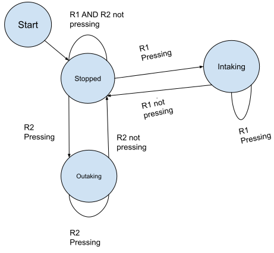

# VEX Team 1759: _High Stakes_ (2024-2025)

Warning: All code before 2024-08-18 is untested because there are no lab sessions until then.

## Robot Infomration
- Robot name: _"No Name"_
- Drive type: undecided

## Control scheme (How to drive the robot)

- Generic Intake Control Scheme
* `R1`: Intaking
* `R2`: Outtaking

Differential drive (split arcade drive scheme)
* `Axis 3` (left joystick vertical axis) : Drives forward/backward
* `Axis 1` (left joystick horizontal axis) : Turns left/right

- Generic Lift Control Scheme
* `Up button`: Moves the lift up by one level.
* `Down button`: Moves the lift down by one level.

- Mobile goal clamping
* `L1`: Clamps the pneumatics clamp
* `L2`: Unclamps the pneumatic clamp

